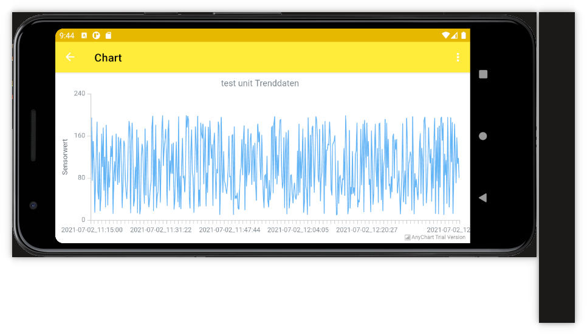

# DataLogger-AndroidApp

Android app für die Modularbeit des CAS OOP Frühjahr 2021

Diese App integriert die LoggingUnits und den UnitHandler in einer App. Somit können die ganzen
Funktionen auf den Units und des UnitHandlers in der App verwendet werden.

Das Darstellen der abgeholten Logdaten wird in einem Chart visualisiert.

[^1]: Screenshot vom Chartscreen